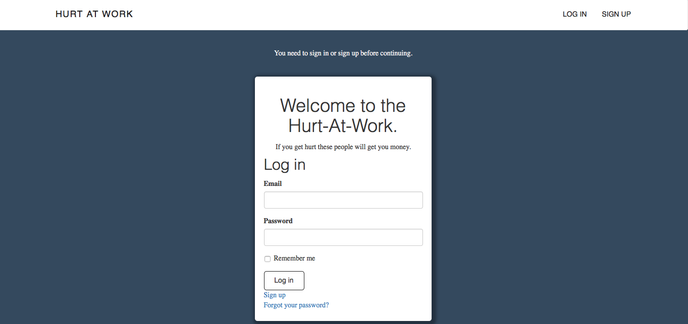
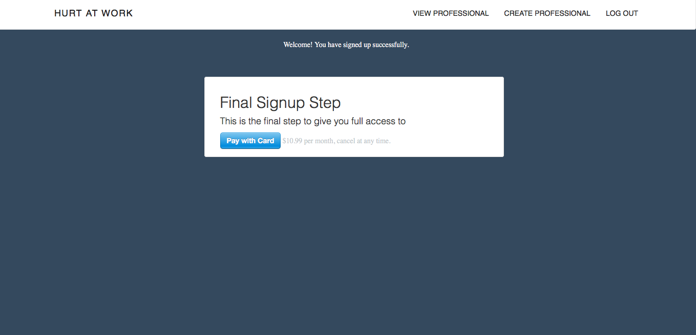
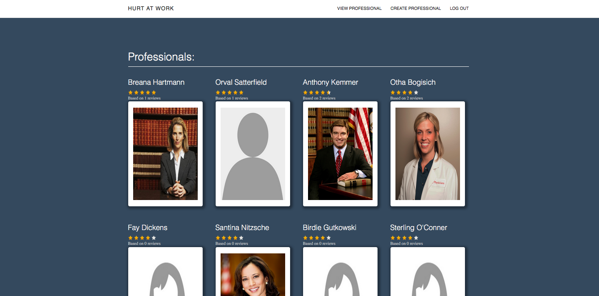
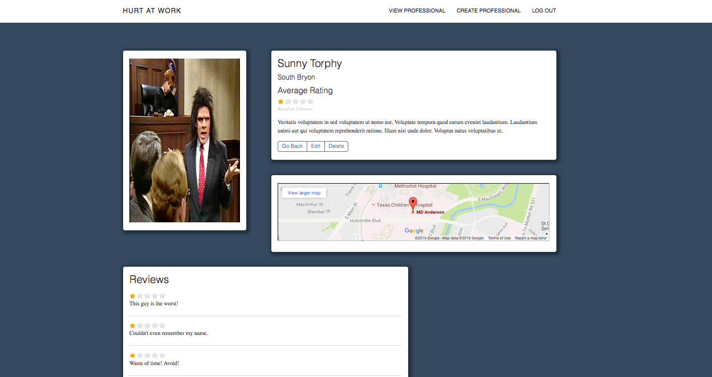

Hurt-At-Work
==
I Was Given 3 Weeks To Design, And Build A Website Of My Choosing From Scratch.
Through My Personal Experience I Saw A Lack Of Resources For Individuals With Work Related Injuries. So I Built A Website Providing Reviews of Legal And Medical Professionals.

Features:

* Stripe API

* Amazon AWS

* Google Maps API

* Authentication

* Understand Relationships between models

Sign In
==

Stripe Subscription
==

Professionals Index
==

View Professional
==

